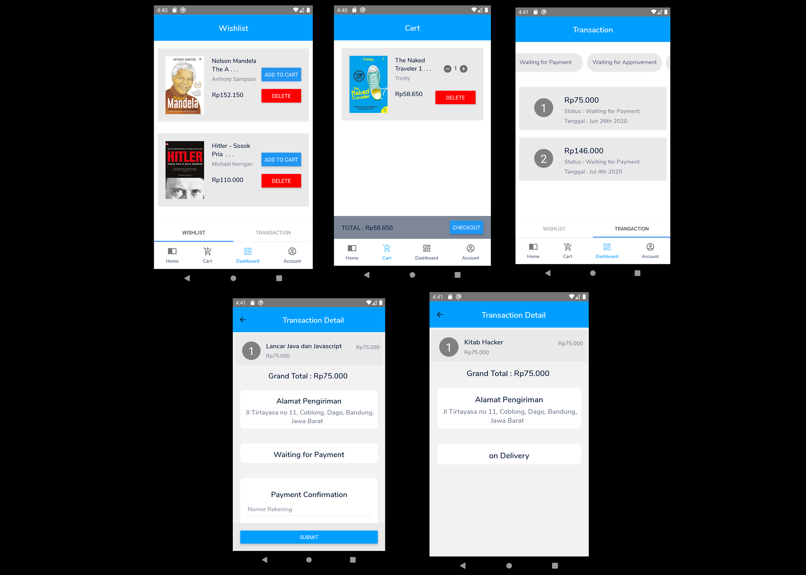

# TokoBuku-app

A full-stack ecommerce app that sell books from various authors and publishers.
 
 
This is a group final project at Purwadhika Coding School, I build this app with 2 of my classmates (Agfan & Giran) in 10 days and presented it at the last day. I realize that this project is far from a good app, so I will learn and practice more in the further.

## Features for User (Mobile-Android)

### `Authentication`
 

- OTP verification + resend using nodemailer
- passwords are hashed
- forget and reset password must enter the verification code that sent to email
- use redux at the front-end to store user detail
 

### `Homepage`
 

- see the latest books
- sort by category
- sort by publishers
- see the products detail
 

### `Wishlist, Cart, and Transaction`
 

 

### `Edit User Profile`
 

 

## Features for Admin (Web)
 

 

### `Dashboard`

 

### `Transaction List and Approve payment Transaction Detail`

 

 

### `Products List and Post Product`

 

